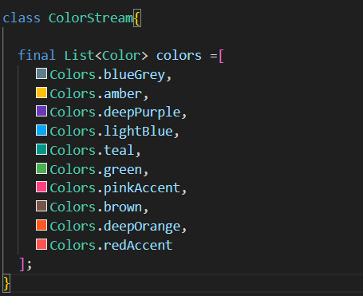
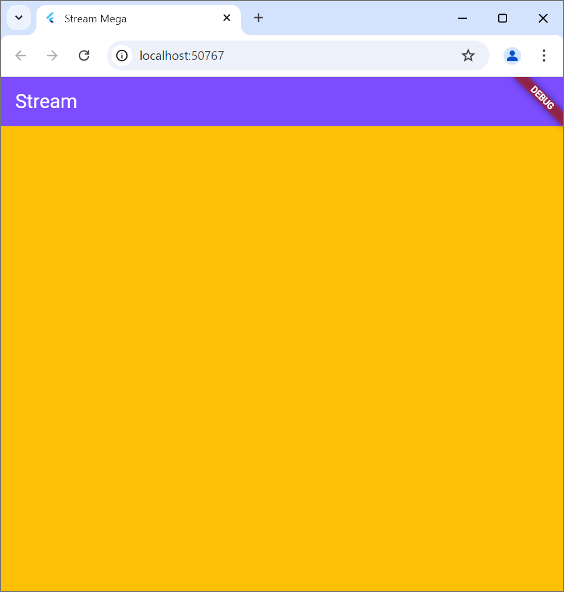
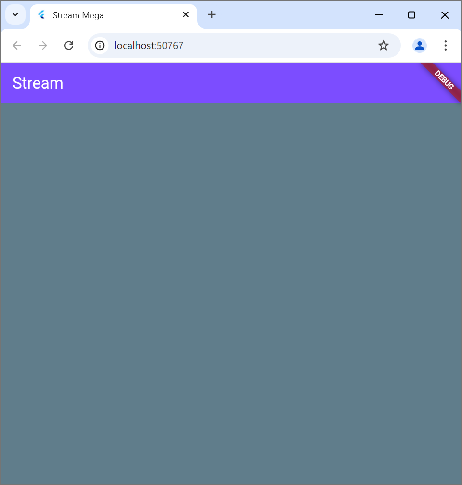
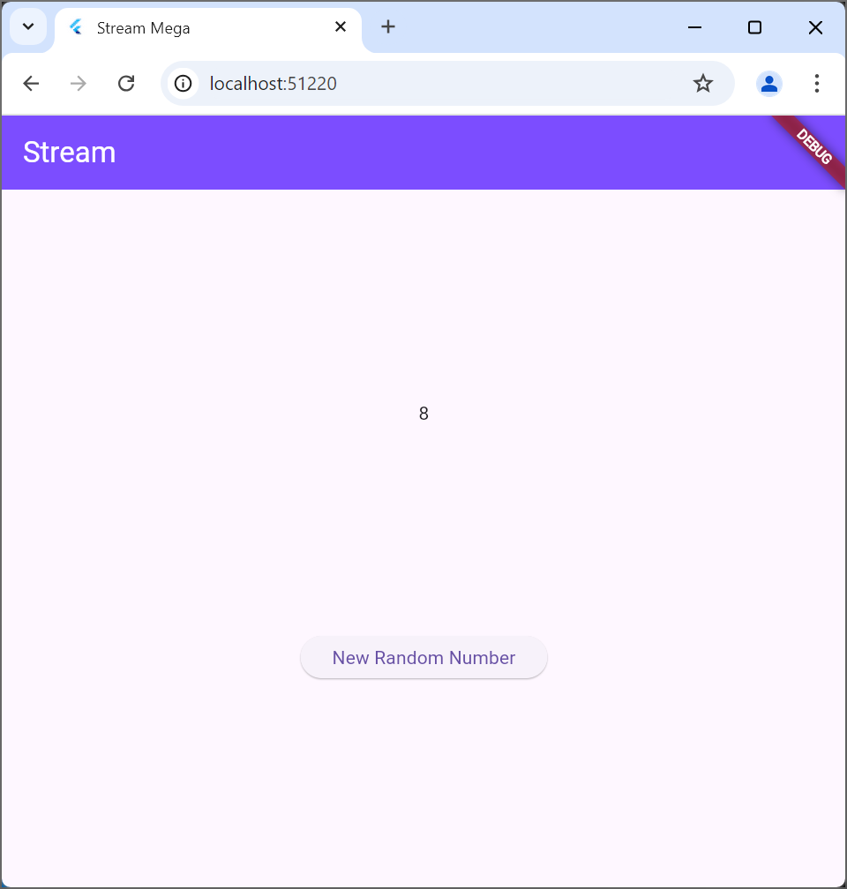
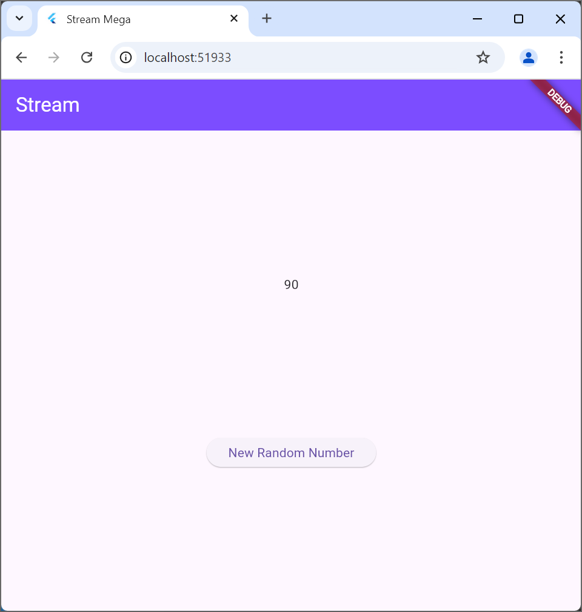
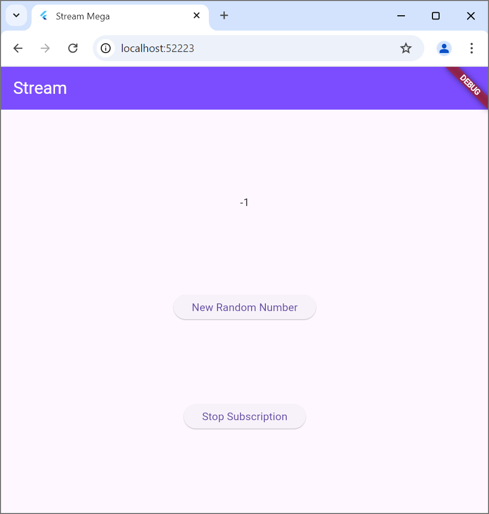
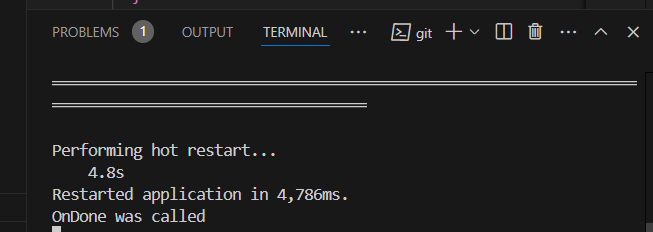
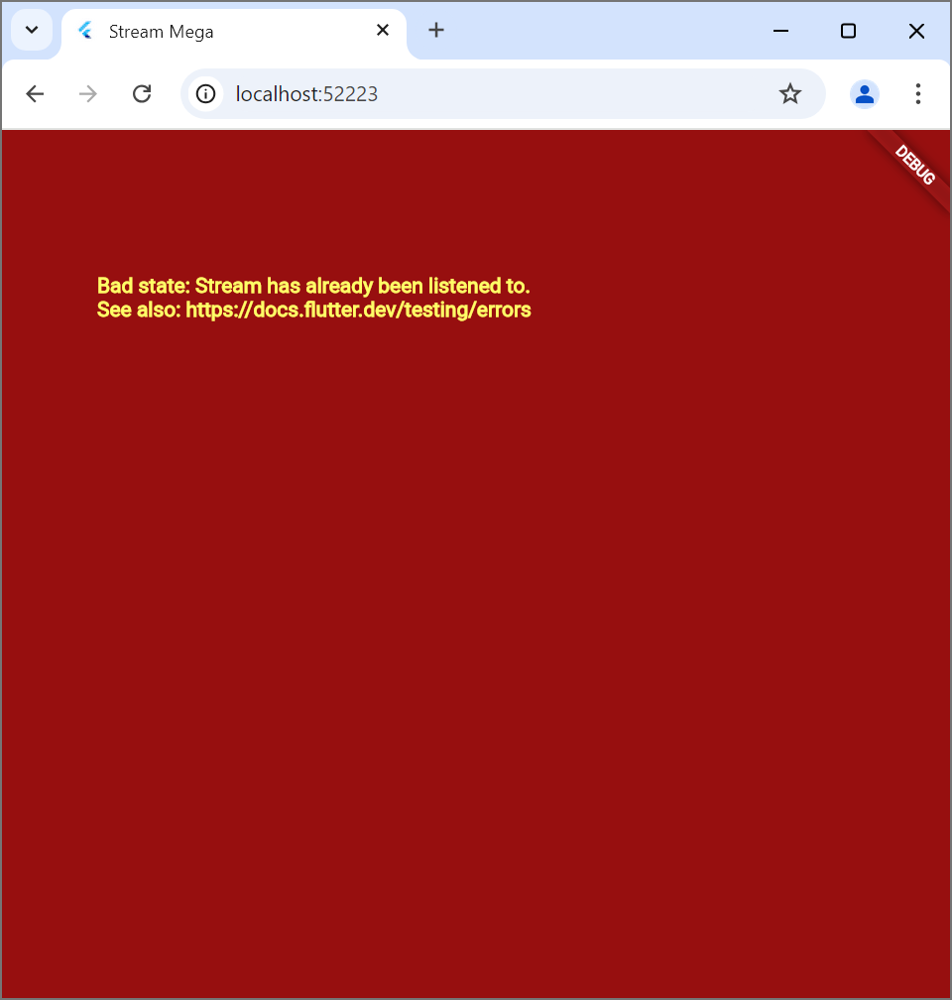
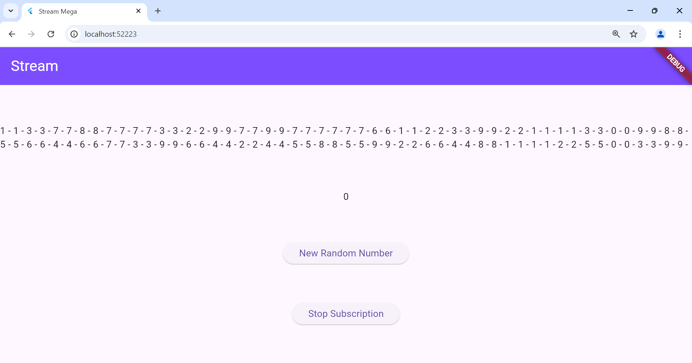

Praktikum 1: Dart Streams
Soal 1:
Soal 2:

soal 3: 
~ digunakan untuk menyambungkan atau meneruskan setaip elemen yang dihasilkan oleh stream.periodic ke stream utama yang dihasilkan oleh fungsi getColors.

~ Stream<Color> getColors() async* yaitu fungsi yang menghasilkan stream bertipe color secara asynchronous menggunakan yield, stream.periodic akan menghasilkan data setiap 1 detik, t yaitu penghitung iterasi dan t % colors.lenght memastikan indeks warna berulang setelah mencapai akhir daftar.

Soal4:

Soal5:
Listen digunakan jika ingin mendengarkan data dari stream secara terus menerus dengan kontrol lebih, sedangkan await for untuk proses data satu per satu dari stream hingga selesai.

Praktikum 2: Stream Controllers dan Sinks
Soal 6: 
langkah 8 adalah langkah untuk menginisialisasikan stream, mendengarkan data baru melalui listen serta memperbarui state (lastNumber) dengan setState agar UI dinamis. Pemanggilan super.initState() untuk memastikan logika bawaan agar berjalan.
Langkah 10 adalah langkah untuk mengirim angka acak ke stream dengan angka acak 0-9 dibuat menggunakan random kemudian ditambahkan ke dalam stream dengan addNumberToSink, dan diterima oleh listener seperti di langkah 8.

Soal 7: 
~ Metode addError untuk menambahkan error ke dalam stream melalui controller.sink.InitState() jika data masuk akan memperbarui tampilan dengan nilai data tersebut, jika error akan menampilkan nilai -1. addRandomNumber() untuk mengirim error ketika fungsi tersebut dipanggil. Kode tersebut menunjukkan cara stream untuk mengirim data atau menangani error. 

Praktikum 3: Injeksi Data Ke Streams
Soal 8: 
●	Jelaskan maksud kode langkah 1-3 tersebut!

Praktikum 4: Subscribe ke Stream Events
Soal 9: 
ketika di tekan button 'Stop Subscription': 

●	Jelaskan maksud kode langkah 2, 6 dan 8 tersebut!

Praktikum 5: Multiple Stream Subscriptions
Soal 10:

terjadi karena ada masalah dalam cara mengelola data, yang artinya kode tersebut mencoba untuk mendengarkan data yang sudah pernah didengarkan sebelumnya.

Soal 11:

ketika ditekan button "new random nuber" beberapa kali akan tampil angka terus bertambah sebanyak dua kali. Karena menggunakan broadcast() dengan cara itu stream yang dikelola oleh controller akan mendukung banyak langganan atau subscriptions.

